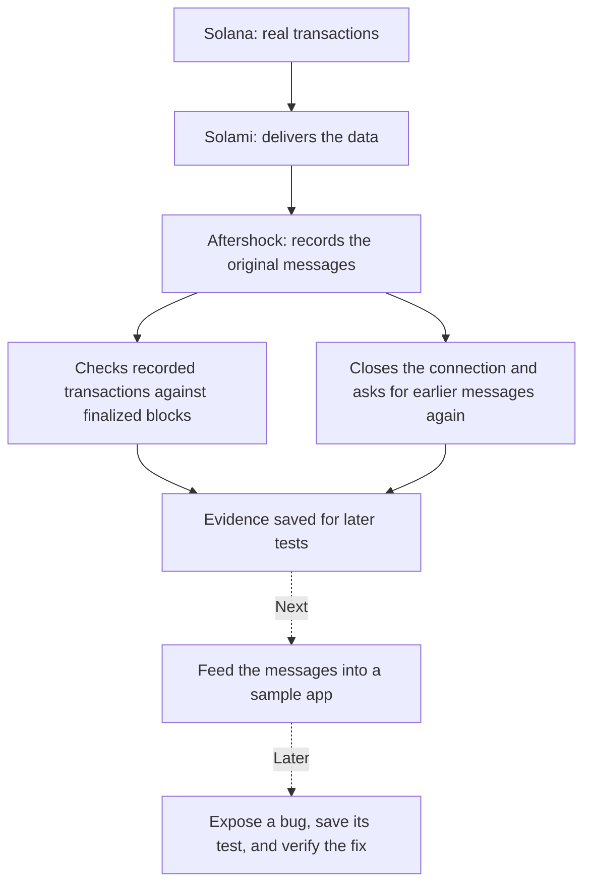

# Understanding Aftershock

Aftershock will test whether a Solana app keeps the right records when messages repeat, arrive late, or processing stops unexpectedly.

Imagine a shop receiving the same order twice after the internet reconnects. Its app should count one order. Aftershock will replay situations like that and show whether the app counted correctly.

## What works now

We have a working recorder and initial checks around its data source. In the first finalized check, all 25 recorded transactions were found in finalized blocks. In a separate reconnect experiment, 25 known transactions arrived again after requesting replay. The recordings and checks are distinct experiments.

Repeated delivery is useful here: an app must handle it without counting the same transaction twice. We have not yet tested a consumer app against these repeated messages.

## Where we are in the build

We are in **Phase 0: establish trustworthy inputs and interfaces**. Some capture tools needed by Phase 1 are already implemented. Phase 0 is not complete: broader coverage validation, external consumer build validation, database setup, licensing, and the remaining adapter decisions are still open.

**Phase 1** will connect recorded inputs to a sample application, show a duplicate-processing bug, export a test, and demonstrate a corrected version passing.

The later phases add real process-crash cases, smaller reproducible cases, a visual workbench, an independently maintained app integration, and the public release.

## What today's result means

Solami successfully delivered live data and replayed known transactions in our bounded experiment. This does not establish that every transaction was captured or that every outage will recover perfectly. Those are separate questions with separate checks.

The product's value comes when these recordings help a developer reproduce an incorrect application result and keep a test that prevents it returning.

## The latest comparison

Think of a block as a page in a ledger. Our recorder saved 25 entries, then stopped. We now read the full three pages it touched and apply the same account filter: there were 29 matching entries, including all 25 we saved. The other four were on the last page, which our recording only partly covered.

That means the recorded entries passed this check. It does not mean the short recording contains every entry, or that an application handles them correctly. The full-block reader also now handles transaction version 1, which the live blocks required.

## Can we read the messages correctly?

The latest check compared the contents of our 25 saved streaming messages with the full ledger responses. All matched, including two examples of the newer transaction format. It checked addresses, instructions and transaction settings, using saved files without contacting Solami again.

We now have evidence that these message fields survive recording and decoding. Turning instructions into application events, such as trades, is a separate step. The external app is now selected; its first planned test focuses on Pump.fun trade records. Its build and replay bridge still need validation before we finalize the adapter interface.

## Which real app will we test?

We selected **solana-realtime-indexer**, an independently maintained app that reads Solana trades and stores them in a database. We pinned one exact code revision so future upstream changes cannot silently change our test.

The first test will feed it the same supported trades twice. The expected result is unchanged stored trades and totals. After that, we will add a controlled stop after a database commit, restart it, and check recovery. Selecting the app is done; running those tests is still ahead. See the [integration plan](../integrations/solana-realtime-indexer/README.md).
