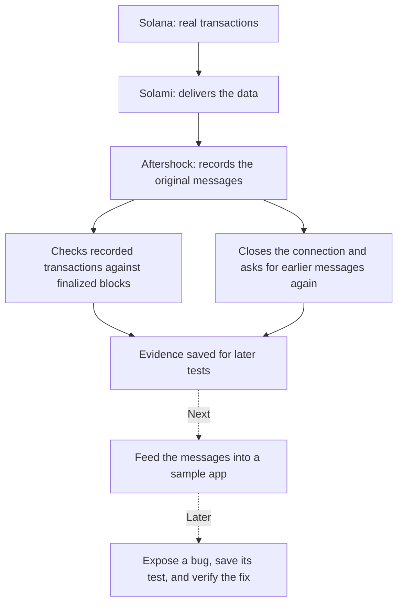

# Understanding Aftershock

Aftershock will test whether a Solana app keeps the right records when messages repeat, arrive late, or processing stops unexpectedly.

Imagine a shop receiving the same order twice after the internet reconnects. Its app should count one order. Aftershock will replay situations like that and show whether the app counted correctly.

## What works now

We have a working recorder and initial checks around its data source. In the first finalized check, all 25 recorded transactions were found in finalized blocks. In a separate reconnect experiment, 25 known transactions arrived again after requesting replay. The recordings and checks are distinct experiments.

Repeated delivery is useful here: an app must handle it without counting the same transaction twice. We have not yet tested a consumer app against these repeated messages.

## Where we are in the build

We are in **Phase 0: establish trustworthy inputs and interfaces**. Some capture tools needed by Phase 1 are already implemented. Phase 0 is not complete: full filtered reference checks, external consumer selection, and the remaining adapter decisions are still open.

**Phase 1** will connect recorded inputs to a sample application, show a duplicate-processing bug, export a test, and demonstrate a corrected version passing.

The later phases add real process-crash cases, smaller reproducible cases, a visual workbench, an independently maintained app integration, and the public release.

## What today's result means

Solami successfully delivered live data and replayed known transactions in our bounded experiment. This does not establish that every transaction was captured or that every outage will recover perfectly. Those are separate questions with separate checks.

The product's value comes when these recordings help a developer reproduce an incorrect application result and keep a test that prevents it returning.
